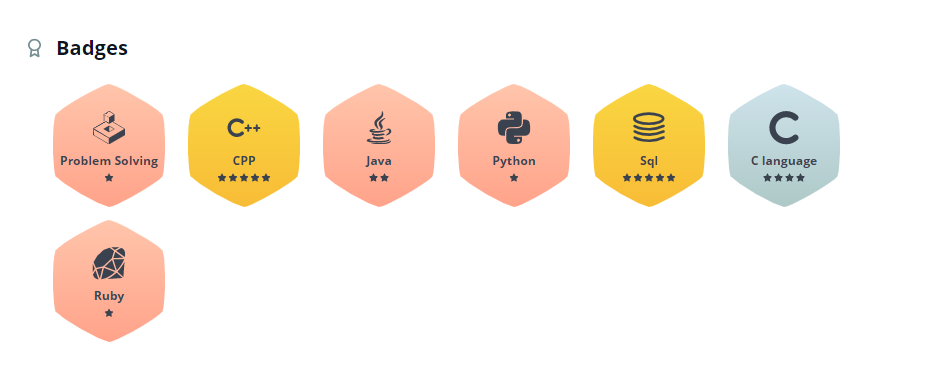

<a href="https://www.hackerrank.com/agarwalvidhi206"></img></a>

  
   
   

  

<h1 align="center">Hi 👋, I'm Vidhi Aggarwal</h1>
<h3 align="center">A passionate frontend developer from India</h3>

  

  

  

- 🔭 I’m currently working on **KIETeats Food App**

- 🌱 I’m currently learning **Android,**

- 👨‍💻 All of my projects are available at [https://github.com/vidhiaggarwal2000](https://github.com/vidhiaggarwal2000)

- 💬 Ask me about **C, C++, HTML, CSS**

- 📫 How to reach me **vidhi.2023mca1057@kiet.edu**

<h3 align="left">Connect with me:</h3>

<h3 align="left">Languages and Tools:</h3>

            

&nbsp;

 
 V.I.S.I.T.O.R.S 
  

